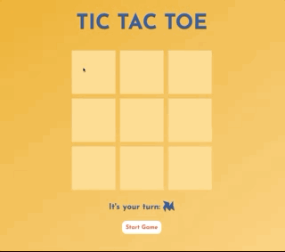

# TIC TAC TOE

## Descripción

Juego TIC TAC TOE (3 en raya) para dos jugadores hecho con React.

En pantalla se mostrará quién tiene el siguiente movimiento a realizar. Si algún jugador hace 3 en raya o hay un empate, los movimentos se bloquerán para que la partida se detenga.

Si en algún momento quieres volver a empezar puedes darle al botón Start Game o refrescar la pantalla de tu navegador.

## Screenshots

## Sobre el código

Estoy trabajando en la mejora de este juego y en la refactorización del código.

## Links

- [Code](https://github1s.com/albavidalm/tic-tac-toe "Code")

- [Live](https://albavidalm.github.io/tic-tac-toe/ "Live View")

## Commands

En el directorio del proyecto puedes ejecutar:

### `npm start" : "react-scripts start"`,

La aplicación está construida usando `create-react-app`, por lo que este comando ejecuta la aplicación en modo de desarrollo. Abre [http://localhost:3000](http://localhost:3000) para verlo en el navegador. También debes ejecutar el archivo del servidor para ejecutar completamente la aplicación. La página se recargará si realizas modificaciones.
También verás errores de lint en la consola.

## Built With

- JavaScript
- React
- classNames
- NPM
- HTML
- CSS
- Sass

## Autora

**Alba Vidal**

- [Profile](https://github.com/albavidalm "Alba Vidal")
- [Email](mailto:albavidalm@gmail.com?subject=Hi "Hi!")
- [Linkedin](https://www.linkedin.com/in/albavidalm/ "Let's work together!")

## 🖤 Support

Compartir es vivir, contributiones y sugerencias son siempre bienvenidas.
